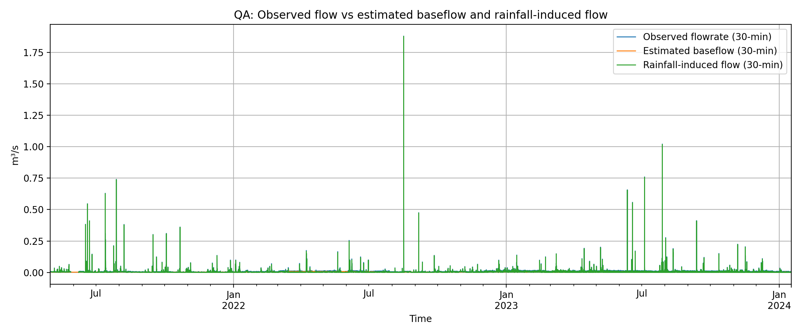
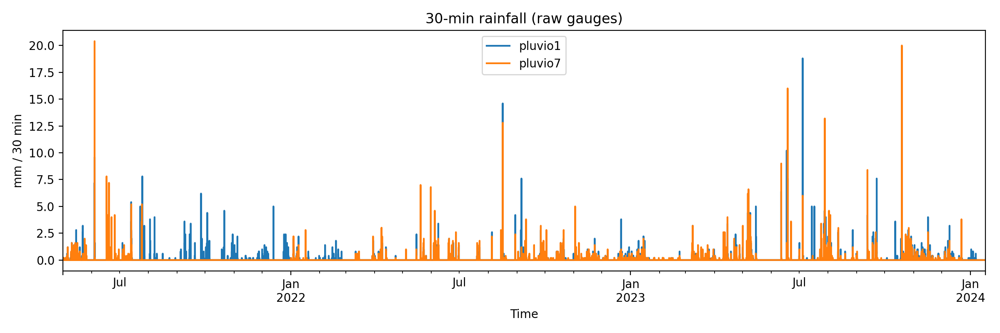
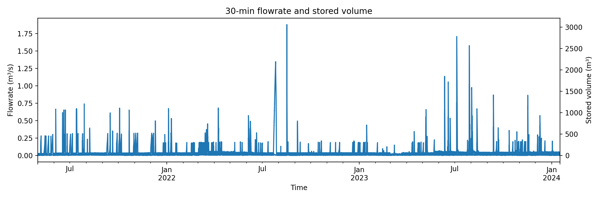

# Internship Hydrology Workflow (CEREMA — Baseflow & Rainfall Flow Separation)

Python workflow developed during my internship to clean, resample and analyse rainfall/flow/storage time series, estimate dry-weather baseflow from storage-tank filling behaviour, and separate rainfall-induced flow.

## What the workflow does
From raw time series exports, the pipeline can:

- Load and clean rainfall + flow + stored volume (handle missing codes such as -6999 / -7999)
- Resample to a chosen time step (**default: 30 min**)
- (Next modules) Mark rain vs dry periods using rain-event tables
- (Next modules) Detect storage filling segments from stored-volume dynamics (dV/dt)
- (Next modules) Estimate baseflow and build a continuous baseflow series
- (Next modules) Compute rainfall-induced flow = total flow − baseflow
- Export intermediate and final CSV outputs and diagnostic figures

## Example figures (included)
These figures are generated from the 30-minute resampled time series and are included to show the typical outputs (raw input data are not included).

### 3) QA plot: observed flow, estimated baseflow, rainfall-induced flow (30-min)


### 1) Rainfall (30-min)


### 2) Flowrate and stored volume (30-min)


## Repository contents
- `scripts/run_pipeline.py` → entry script (currently: load → clean → resample → export)
- `Inputs/` → place raw input files locally (**ignored by git**)
- `Outputs/` → outputs written locally (**ignored by git**)
- `example_figures/` → small example figures tracked in the repo
- `src/` → package modules (will be used as the workflow grows)

## How to run

### 1) Install dependencies
```bash
python3 -m venv .venv
source .venv/bin/activate
pip install -r requirements.txt
